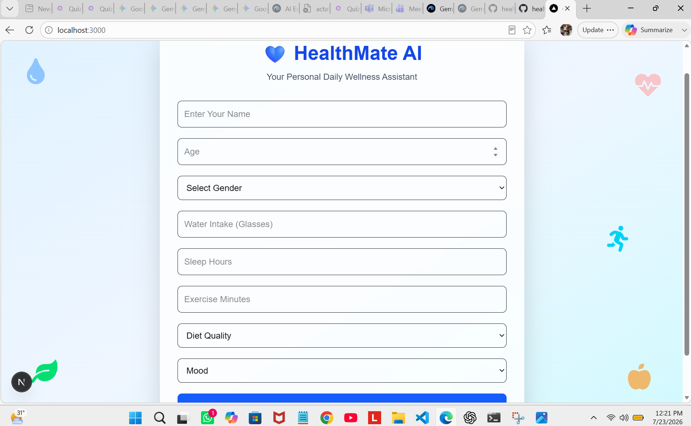
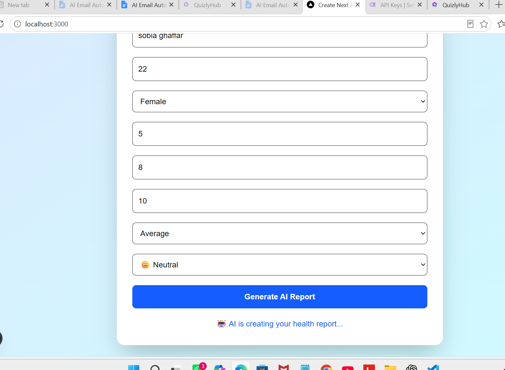
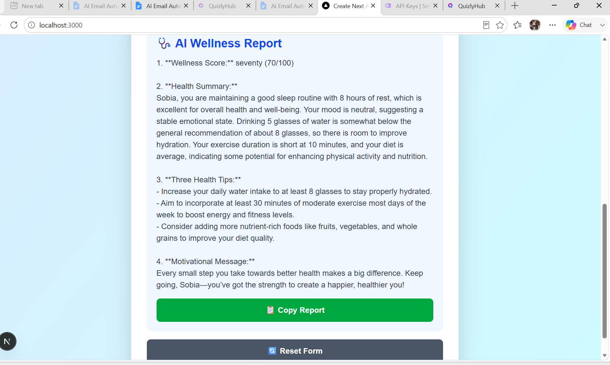

# 💙 HealthMate AI

## a. App Name, What It Does, and the Real Problem It Solves

### App Name
HealthMate AI

### What It Does
HealthMate AI is an AI-powered personal wellness assistant that analyzes a user's daily health habits and generates personalized wellness recommendations. Users provide information such as their name, age, gender, water intake, sleep hours, exercise, diet, and mood. Based on this information, the AI generates a wellness report that includes a wellness score, a health summary, personalized health tips, and a motivational message.

### Real Problem It Solves (and For Whom)
Many students and busy individuals struggle to maintain healthy daily habits because of busy schedules and a lack of personalized guidance. HealthMate AI helps users better understand their daily lifestyle by providing simple, personalized, AI-powered wellness recommendations. It is designed for students and anyone who wants an easy way to improve their daily health habits.

---

## b. LIVE Deployed URL

**Live Application**

HealthMate AI Live Demo: https://healthmate-ai-smoky.vercel.app

---

## c. Features

1. User-friendly and responsive interface
2. Collects personal health information
3. Tracks daily water intake
4. Records sleep duration
5. Records daily exercise
6. Tracks diet quality
7. Tracks daily mood
8. Generates an AI-powered wellness report
9. Calculates a wellness score
10. Provides a health summary
11. Suggests three personalized health tips
12. Displays a motivational message
13. Copy report to clipboard
14. Reset the form for a new health assessment

---

## d. AI Feature

### What the AI Does

The AI analyzes the user's daily health information and generates a personalized wellness report. It evaluates the user's lifestyle habits and provides practical, encouraging suggestions to promote healthier daily routines. The AI does not diagnose diseases or provide medical treatment.

### System Prompt

```text
You are HealthMate AI.

The user's information is:

Name: ${name}
Age: ${age}
Gender: ${gender}
Water Intake: ${water} glasses
Sleep: ${sleep} hours
Exercise: ${exercise} minutes
Diet: ${diet}
Mood: ${mood}

Write:
1. Wellness Score out of 100
2. Health Summary
3. Three health tips
4. One motivational message

Do not diagnose diseases.
```

---

## e. Tools, Services, and AI Models Used

### Frontend
- Next.js
- React
- JavaScript
- HTML
- CSS

### AI Services
- OpenRouter AI API
- OpenAI JavaScript SDK

### AI Model
- GPT-4.1 Mini (`openai/gpt-4.1-mini`)

### Deployment
- Vercel

### Version Control
- GitHub

---

## f. Screenshots of the App

### 1. Home Page



### 2. Generating AI Report



### 3. Health Report


---

## g. How to Run the Project

### Step 1: Clone the Repository

```bash
git clone https://github.com/sobiaghaffar-ai/healthmate-ai
```

### Step 2: Open the Project Folder

```bash
cd healthmate-ai
```

### Step 3: Install Dependencies

```bash
npm install
```

### Step 4: Create a `.env.local` File

Create a `.env.local` file in the project root and add your own OpenRouter API key:

```env
OPENROUTER_API_KEY=your_openrouter_api_key_here
```

> Replace `your_openrouter_api_key_here` with your own OpenRouter API key.

### Step 5: Start the Development Server

```bash
npm run dev
```

### Step 6: Open Your Browser

Visit:

```text
http://localhost:3000
```

---

## Author

**Sobia Ghaffar**

GitHub: https://github.com/sobiaghaffar-ai